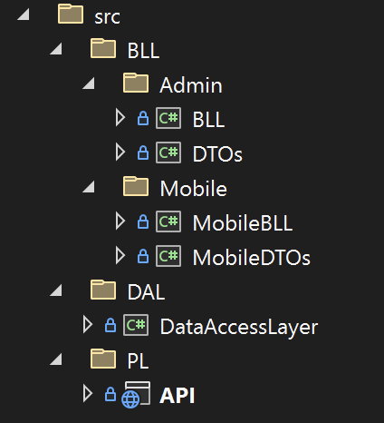
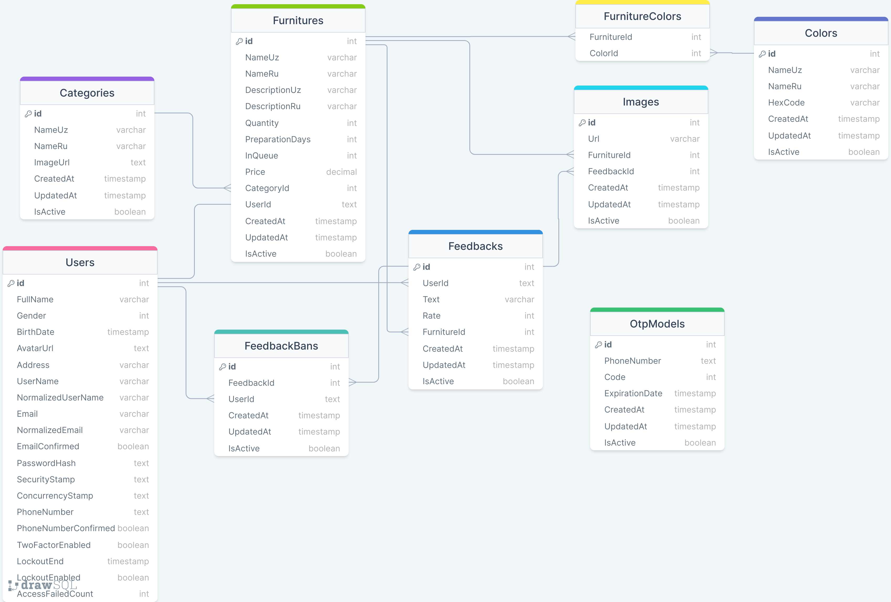

# FURNITURE API

> ## About
> The _Furniture_ API is the backend connection between the client side and the [PostgreSQL](https://www.postgresql.org/) database. This API utilizes multiple models: Category, Color, Feedback, FeedbackBan, Image, Furniture, OtpModel and User.

## Structure

## Packages
- BLL (Business Logic Layer)
-- Admin
--- BLL.csproj
---- 
---- 
---- 
---- 
--- DTOs.csproj
---- 
-- Mobile
--- MobileBLL.csproj
---- 
--- MobileDTOs.csproj
- DAL (Data Access Layer)
-- DataAccessLayer.csproj
--- 
- PL (Project Layer)
-- API.csproj
--- 
--- 
--- 
---  
--- 
--- 
--- 

## Catalogue of Routes
### Admin
>>> | HTTP Method | URL Path |
>>> |--|--|--|--|
>>> | POST | /api/v1/Admin/create |
>>> | PUT | /api/v1/Admin/update |
>>> | GET | /api/v1/Admin/get-all |
>>> | DELETE | /api/v1/Admin/{id} |
>>> | PUT | /api/v1/Admin/activate/{userId} |
>>> | PUT | /api/v1/Admin/reset-password/{userId} |

### Auth
>>> | HTTP Method | URL Path |
>>> |--|--|--|--|
>>> | POST | /api/v1/Auth/login |
>>> | POST | /api/v1/Auth/register |
>>> | POST | /api/v1/Auth/send-otp |
>>> | POST | /api/v1/Auth/verify-otp |
>>> | PUT | /api/v1/Auth/logout |
>>> | PUT | /api/v1/Auth/change-password |
>>> | DELETE | /api/v1/Auth/delete |
>>> | POST | /api/v1/Auth/profile/set-avatar |
>>> | PUT | /api/v1/Auth/profile/change-avatar |
>>> | DELETE | /api/v1/Auth/profile/delete-avatar/{userId} |
>>> | GET | /api/v1/Auth/validate-token |
>>> | PUT | /api/v1/Auth/update-profile |

### Category
>>> | HTTP Method | URL Path |
>>> |--|--|--|--|
>>> | GET | /api/v1/Category/{lang}/all |
>>> | GET | /api/v1/Category/{lang}/paged |
>>> | GET | /api/v1/Category/{lang}/{id} |
>>> | GET | /api/v1/Category/{id} |
>>> | POST | /api/v1/Category/{lang} |
>>> | PUT | /api/v1/Category/{lang} |
>>> | DELETE | /api/v1/Category/delete/{id} |
>>> | PATCH | /api/v1/Category/archive/{id} |
>>> | PATCH | /api/v1/Category/unarchive/{id} |

### Color
>>> | HTTP Method | URL Path |
>>> |--|--|--|--|
>>> | GET | /api/v1/Color/{lang}/all |
>>> | GET | /api/v1/Color/{lang}/paged |
>>> | GET | /api/v1/Color/{lang}/{id} |
>>> | GET | /api/v1/Color/{id} |
>>> | POST | /api/v1/Color/{lang} |
>>> | PUT | /api/v1/Color/{lang} |
>>> | DELETE | /api/v1/Color/delete/{id} |
>>> | PATCH | /api/v1/Color/archive/{id} |
>>> | PATCH | /api/v1/Color/unarchive/{id} |

### Furniture
>>> | HTTP Method | URL Path |
>>> |--|--|--|--|
>>> | GET | /api/v1/Furniture/{lang}/all |
>>> | GET | /api/v1/Furniture/{lang}/paged |
>>> | GET | /api/v1/Furniture/{lang}/{id} |
>>> | GET | /api/v1/Furniture/{id} |
>>> | POST | /api/v1/Furniture/{lang} |
>>> | PUT | /api/v1/Furniture/{lang} |
>>> | DELETE | /api/v1/Furniture/delete/{id} |
>>> | PATCH | /api/v1/Furniture/archive/{id} |
>>> | PATCH | /api/v1/Furniture/unarchive/{id} |

### Image
>>> | HTTP Method | URL Path |
>>> |--|--|--|--|
>>> | POST | /api/v1/Image |
>>> | DELETE | /api/v1/Image |
>>> | POST | /api/v1/Image/multiple |
>>> | DELETE | /api/v1/Image/multiple |

### Mobile
>>> | HTTP Method | URL Path |
>>> |--|--|--|--|
>>> | GET | /api/v1/Mobile/categories/{lang} |
>>> | GET | /api/v1/Mobile/categories/{id}/{lang} |
>>> | GET | /api/v1/Mobile/furnitures/{lang} |
>>> | GET | /api/v1/Mobilefurnitures/{id}/{lang} |
>>> | GET | /api/v1/Mobilefurnitures/feedbacks/{furnitureId} |
>>> | GET | /api/v1/Mobile/feedbacks/{id} |
>>> | POST | /api/v1/Mobile/feedbacks |
>>> | POST | /api/v1/Mobile/feedbacks/ban |

### Users
>>> | HTTP Method | URL Path |
>>> |--|--|--|--|
>>> | GET | /api/v1/Users/all |
>>> | GET | /api/v1/Users/{id} |
>>> | DELETE | /api/v1/Users/{id} |

## Entity Relationship Diagram
> 
>> ###### [(Show in Web-site)](https://drawsql.app/teams/my-manager/diagrams/furniture)

## Contributing💡
If you want to contribute to this project and make it better with new ideas, your pull request is very welcomed.

If you have any question or issue, It may have bugs that i have missed. You can create <a href="https://github.com/buzruk/Furniture/pulls">Pull request</a>.

